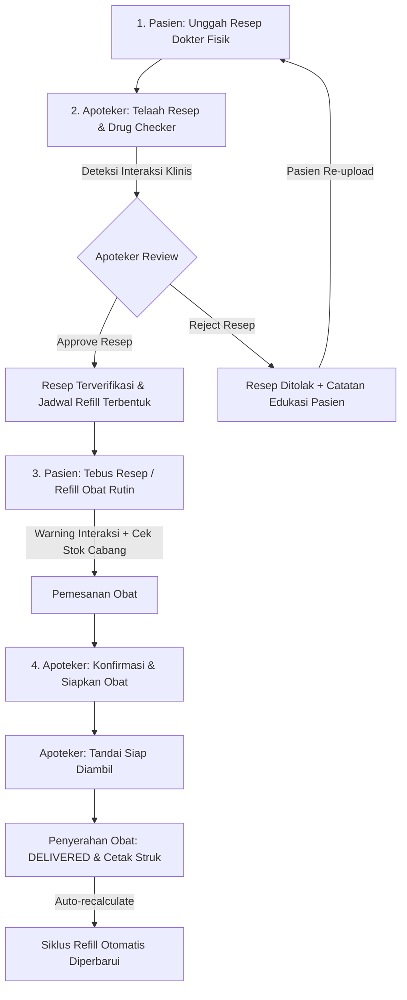

# 📋 Dokumentasi Teknis & Panduan Pengujian Sistem
## Proyek: Apotek Alpro — Smart Prescription & Multi-Branch Auto-Refill System

---

## 📌 Ringkasan Eksekutif
Sistem **Smart Prescription & Refill Apotek Alpro** adalah platform berbasis web modern yang dirancang untuk mendigitalisasi alur pelayanan resep obat kronis, verifikasi klinis apoteker, deteksi interaksi obat secara real-time, transparansi ketersediaan stok di 5 cabang apotek, serta otomatisasi siklus pengisian ulang (*auto-refill*) obat pasien.

---

## 🌐 Akses Aplikasi & Akun Uji Coba

- **Live Production URL**: [https://apotek-alpro-smart-refill.vercel.app](https://apotek-alpro-smart-refill.vercel.app)
- **Repository GitHub**: [https://github.com/BrianlyHedi/apotek-alpro-smart-refill](https://github.com/BrianlyHedi/apotek-alpro-smart-refill)

### 👥 Kredensial Demo (Dilengkapi Tombol 1-Klik Autofill di Halaman Login):

| Peran (Role) | Nama Pengguna | Alamat Email | Password | Tombol Shortcut di Login |
| :--- | :--- | :--- | :--- | :--- |
| **Pasien** (`PATIENT`) | Budi Santoso | `budi.pasien@demo.com` | `Demo123!` | Klik **[Isi Pasien]** |
| **Apoteker** (`PHARMACIST`) | Apt. Siti Aminah, S.Farm | `siti.apoteker@demo.com` | `Demo123!` | Klik **[Isi Apoteker]** |
| **Admin** (`ADMIN`) | Admin Greenville | `admin.greenville@demo.com` | `Demo123!` | Klik **[Isi Admin]** |

---

## 🌟 Fitur Unggulan Sistem (76/76 Acceptance Criteria Terpenuhi)

### 1. 🧑 Portal Pasien (`/patient`)
- **Upload Resep Dokter**: Validasi file eksplisit (JPG/PNG/WEBP $\le 5$MB), *Live Image Preview*, dan fitur *Re-upload* resep yang ditolak (*REJECTED*) dengan catatan perbaikan apoteker.
- **Jadwal Refill Obat Rutin**: Halaman khusus manajemen terapi kronis, tombol *Pause & Resume* jadwal, tambah jadwal mandiri, input kuantitas manual angka & stepper $(+/-)$, serta transparansi stok fisik real-time per cabang.
- **Deteksi Interaksi Obat di Checkout**: Banner peringatan tingkat risiko (*MILD / MODERATE / SEVERE*) dan wajib centang persetujuan (*Acknowledgment Checkbox*) sebelum pesanan dapat diproses.
- **Pelacakan Pesanan & Reorder**: Stepper timeline progres penyiapan obat, modal rincian invoice, dan tombol *Pesan Ulang (Reorder)* instan.
- **Cek Stok Multi-Cabang**: Pemantauan 28 SKU obat di 5 cabang apotek secara langsung dengan animasi denyut (*Pulse Keyframes*).
- **Pengaturan Profil**: Update data diri (WhatsApp/Alamat) dan ganti kata sandi terintegrasi Supabase Auth.

### 2. 👨‍⚕️ Portal Apoteker (`/pharmacist`)
- **Telaah Resep & Transkripsi Klinis**: Lightbox zoom foto resep fisik resolusi tinggi, autocomplete pencarian master 28 SKU obat, dan dialog analisis klinis interaksi obat.
- **Manajemen Inventori Cabang**: Filter status stok (*Aman/Menipis/Habis*), input kuantitas angka manual, dan pencatatan timestamp relatif pembaruan stok.
- **Pemrosesan Pesanan & Cetak Struk**: Filter antrean pesanan dan modal cetak struk resmi apotek dengan isolasi print CSS (*Print Isolation*) bersih tanpa tombol navigasi.

### 3. 👑 Portal Administrator (`/admin`)
- **Manajemen Jaringan Cabang**: Form tambah cabang baru (otomatis menginisialisasi 28 SKU obat), edit data operasional, switch status aktif/nonaktif, dan modal statistik performa cabang.
- **Manajemen Pengguna & Hak Akses**: Form pembuatan user baru (Pasien/Apoteker/Admin), pencarian multi-field, dan pemetaan penugasan staf apoteker ke cabang tertentu.

### 4. 🔔 Notifikasi Realtime & Keamanan Data
- **Pusat Notifikasi Data-Driven**: Auto-polling notifikasi dinamis (jadwal refill jatuh tempo $H-7$, status resep, antrean pesanan cabang, dan peringatan stok menipis).
- **PostgreSQL Row Level Security (RLS)**: Penerapan kebijakan RLS pada 10 tabel database untuk isolasi akses data antar pengguna.

---

## 🧪 Skenario Pengujian Alur Lengkap (Testing Walkthrough)

### Langkah Uji Coba Mandiri:
1. **Langkah 1 (Pasien)**: Login sebagai Pasien $\rightarrow$ Buka menu **Resep Saya** $\rightarrow$ Unggah foto resep baru.
2. **Langkah 2 (Apoteker)**: Buka tab baru/incognito, login sebagai Apoteker $\rightarrow$ Buka menu **Telaah Resep** $\rightarrow$ Perbesar foto resep $\rightarrow$ Masukkan obat (misal: *Candesartan 8mg* dan *Amlodipine 5mg*) $\rightarrow$ Lihat peringatan interaksi klinis $\rightarrow$ Klik **Setujui Resep**.
3. **Langkah 3 (Pasien)**: Kembali ke Pasien $\rightarrow$ Buka **Jadwal Refill** $\rightarrow$ Klik **Refill Sekarang** $\rightarrow$ Ketik jumlah unit obat $\rightarrow$ Pilih cabang apotek (lihat indikator stok) $\rightarrow$ Konfirmasi Refill.
4. **Langkah 4 (Apoteker)**: Buka menu **Pesanan Obat** $\rightarrow$ Ubah status pesanan hingga **Selesai (`DELIVERED`)** $\rightarrow$ Klik **Cetak Struk**.
5. **Langkah 5 (Admin)**: Login sebagai Admin $\rightarrow$ Buka menu **Cabang Apotek** & **Pengguna** untuk menguji pengelolaan data master dan pembuatan user baru.

---

## 🛠️ Tech Stack & Keputusan Arsitektur

- **Frontend & Fullstack**: Next.js 16 (App Router, Server Components & Server Actions)
- **Bahasa**: TypeScript (Strict Type Safety)
- **Database**: PostgreSQL Hosted on Supabase
- **ORM**: Prisma Client v6
- **Autentikasi**: Supabase Auth (SSR Cookie-based Session) + Middleware RBAC Guard
- **Penyimpanan Berkas**: Supabase Storage Bucket (`prescriptions`)
- **Desain & UI**: Tailwind CSS v4, Base UI / Radix Primitives, Lucide Icons, Glassmorphism & Custom Keyframe Animations
